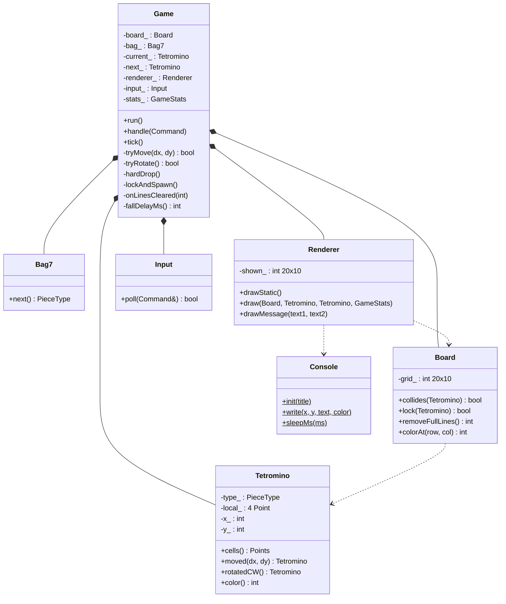

# Tetris Console — bản chạy thử cho nhóm

Khung game Tetris viết bằng **C++ thuần** trên console Windows, chia theo hướng đối tượng.
Đã chạy được: bảng chơi, 7 khối có màu, khối rơi theo thời gian, di chuyển, xoay, rơi tức thì, xem trước khối tiếp theo, tạm dừng, thua và chơi lại.

**Chưa có — dành cho nhóm viết tiếp:** xóa hàng, tính điểm theo hàng, lên cấp và tăng tốc.

---

## 1. Chạy thử

**Cách 1 — dòng lệnh:**

```bat
build.bat run
```

`build.bat` tự tìm `g++` (Code::Blocks / MinGW) hoặc `clang++`.

**Cách 2 — tự gõ lệnh:**

```bat
g++ -std=c++14 -Wall src\*.cpp -o tetris.exe
```

Nếu dùng `clang++` bản MSVC thì thêm `-luser32` ở cuối.

**Cách 3 — Code::Blocks:** tạo *Console application* rỗng → *Project → Add files…* → chọn toàn bộ file trong `src/` → *Settings → Compiler* bật `-std=c++14` → F9.

## 2. Điều khiển

| Phím | Tác dụng |
|---|---|
| ← → (hoặc A D) | Sang trái / phải |
| ↑ (hoặc W) | Xoay theo chiều kim đồng hồ |
| ↓ (hoặc S) | Rơi nhanh 1 ô |
| Space | Rơi tức thì |
| P | Tạm dừng / chơi tiếp |
| R | Chơi lại |
| Esc | Thoát |

## 3. Cấu trúc

```
TetrisConsole/
├── build.bat
├── README.md
└── src/
    ├── main.cpp          tạo Game và gọi run()
    ├── Game.h/.cpp       vòng lặp + luật chơi
    ├── Board.h/.cpp      bảng 10 × 20, va chạm, khóa khối, xóa hàng
    ├── Tetromino.h/.cpp  hình dạng, màu, di chuyển, xoay
    ├── Bag7.h/.cpp       chọn khối kế tiếp theo kiểu "túi 7 khối"
    ├── Renderer.h/.cpp   vẽ lên màn hình, chống nhấp nháy
    ├── Input.h/.cpp      đọc phím → Command
    └── Console.h/.cpp    bọc toàn bộ Windows API
```

| Lớp | Chịu trách nhiệm | Không được làm |
|---|---|---|
| `Game` | Quyết định luật: khi nào rơi, khóa, sinh khối, thua | Tự vẽ, tự đọc phím |
| `Board` | Lưu các ô đã khóa, trả lời "có va chạm không?" | Biết khối đang rơi là khối nào |
| `Tetromino` | Hình dạng và vị trí của **một** khối | Biết bảng chơi ra sao |
| `Bag7` | Trả về loại khối tiếp theo | — |
| `Renderer` | Biến trạng thái game thành hình trên màn hình | Thay đổi trạng thái game |
| `Input` | Dịch phím bấm thành `Command` | Biết lệnh đó dùng để làm gì |
| `Console` | Gọi Windows API (vị trí con trỏ, màu, ghi chữ) | — |

Nguyên tắc: **chỉ `Console.cpp` và `Input.cpp` được include thư viện của Windows.** Các lớp logic (`Board`, `Tetromino`, `Bag7`) là C++ chuẩn, có thể kiểm thử mà không cần màn hình.

### Sơ đồ lớp



## 4. Ba ý tưởng thiết kế nên hiểu trước khi sửa code

**Khối không tự sửa mình.** `moved()` và `rotatedCW()` trả về **bản sao**. `Game` đưa bản sao cho `Board::collides()` kiểm tra, hợp lệ mới nhận:

```cpp
Tetromino candidate = current_.moved(dx, dy);
if (board_.collides(candidate)) return false;
current_ = candidate;
```

Nhờ vậy không bao giờ phải "lùi lại" khi đi sai.

**Mỗi ô vẽ bằng 2 ký tự.** Ký tự console cao gấp đôi bề ngang, nên `██` mới cho ra ô vuông.

**Chỉ vẽ lại ô thay đổi.** `Renderer` nhớ màu đang hiển thị ở từng ô; mỗi vòng lặp chỉ ghi những ô khác đi, nên màn hình không nhấp nháy như khi dùng `system("cls")`.

## 5. Việc còn trống — gợi ý chia cho nhóm

| Việc | File | Trạng thái |
|---|---|---|
| **Xóa hàng đầy** | `Board::removeFullLines()` | ⬜ Đang `return 0` — có hướng dẫn trong chú thích |
| **Tính điểm, đếm hàng, lên cấp** | `Game::onLinesCleared()` | ⬜ Mới cộng số hàng |
| **Tăng tốc theo cấp độ** | `Game::fallDelayMs()` | ⬜ Đang cố định 500 ms |
| Khối bóng (ghost piece) | `Renderer::draw()` | ⬜ Chưa có |
| Xoay ngược chiều + bảng wall kick SRS | `Tetromino`, `Game::tryRotate()` | 🟨 Đã có xoay xuôi + đẩy lệch ±2 cột |
| Giữ khối (Hold) | `Game`, `Renderer` | ⬜ Chưa có |
| Lưu điểm cao ra file | lớp mới `HighScore` | ⬜ Chưa có |

Lưu ý so với gợi ý phân công tuần 2 của giảng viên: bản này **đã có** khối vuông vức (việc của SV3) và xoay cơ bản (việc của SV4). Nhóm có thể giao SV3 làm khối bóng và giao diện, SV4 làm xoay ngược chiều + SRS.

### Quy ước git gợi ý

- Mỗi việc một nhánh: `feature/remove-line`, `feature/score-level`, `feature/ghost-piece`, `feature/rotate-srs`, `feature/hold`, `feature/high-score`, `fix/...`
- Nhánh `main` luôn biên dịch được; trưởng nhóm review rồi mới merge.
- Commit nhỏ, mô tả rõ: `Board: xoa hang day va dich cac hang phia tren xuong`.

## 6. Ghi chú kỹ thuật

- Chuẩn **C++14**. Đã biên dịch không cảnh báo bằng g++ 14 (`-Wall -Wextra -pedantic -Wshadow -Wconversion`) và clang++ 22.
- Game đổi bảng mã console sang **437** để có ký tự khối `█` và khung viền, thoát game thì trả lại bảng mã cũ.
- Console không có màu cam nên khối **L dùng vàng đậm**.
- Chỉ chạy trên Windows (dùng `<windows.h>` và `<conio.h>`).
